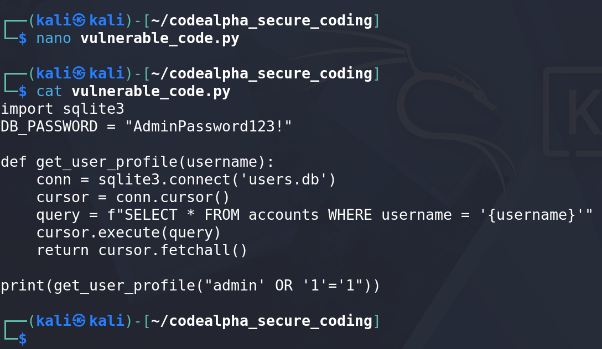
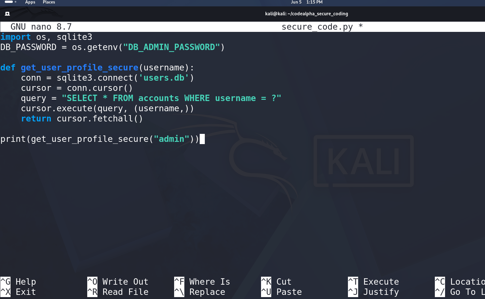

# 🛡️ CodeAlpha: Advanced Secure Coding Review (Python)

Welcome to my Secure Coding Review project completed during my Cyber Security Internship at CodeAlpha. This repository serves as a practical, open-source guide for learners and security enthusiasts to understand how insecure code creates severe vulnerabilities and how defensive engineering successfully neutralizes them.

---

## 💡 What is a Secure Coding Review? (Learner's Guide)

### 🤔 What is it?
A **Secure Coding Review** (also known as a Secure Code Audit) is the process of manually or automatically inspecting an application's source code before it goes live. Think of it as a security guard checking the architectural blueprint of a bank to find weak windows or unlocked doors before the building is even constructed.

### 🎯 What was the Purpose of this Task?
In the software industry, developing code that "just works" is not enough. If code is functional but insecure, hackers can easily exploit it to steal data or compromise systems. 

**The core mindset of this project is:**
1. **The offensive Mindset:** Identifying coding flaws that lead to critical risks like **SQL Injection** and **Hardcoded Credentials** based on the OWASP Top 10 framework.
2. **The Defensive Mindset:** Rewriting the application using industrial-grade security standards (Remediation) to patch those vulnerabilities completely.

---

## 🚨 1. The Vulnerable Phase (`vulnerable_code.py`)

### Identified Flaws & Risks:
* **SQL Injection (SQLi):** The code utilized dynamic string interpolation (`f-strings`) to concatenate user input directly into the database command. An attacker inputting `"admin' OR '1'='1"` can bypass authentication checks entirely because the database interprets data as executable code.
* **Hardcoded Cleartext Secrets:** The administrative database password was written directly into the file (`DB_PASSWORD = "AdminPassword123!"`). If this source code leaks, the production environment is instantly compromised.

#### 📸 Proof of Concept (Vulnerable Code Audit)
Below is the screen capture showing the implementation of the insecure application structure:

---

## 🛡️ 2. The Secure Phase (`secure_code.py`)

### Defensive Mitigations Engineered:
* **Parameterized Queries (Prepared Statements):** I transitioned the application to use native parameterized placeholders (`?`). This creates a separation between the SQL command structure and user-supplied data. Even if a hacker inputs an SQL injection payload, the database treats it strictly as a harmless text string literal.
* **Environment Variable Extraction:** I removed the plain-text password from the codebase and re-engineered the logic to call secrets securely from the operating system environment using Python's `os.getenv` module.

#### 📸 Proof of Concept (Secured Code Audit)
Below is the screen capture showcasing the hardened, fully safe database interaction layer:

---

## 🧠 Key Takeaways for Learners
1. **Never Trust User Input:** Treat all incoming user data as highly malicious until proven otherwise.
2. **Keep Data Separate From Code:** Parameterization ensures the SQL engine never executes user input.
3. **Secrets Management:** Never push api keys, tokens, or passwords to public repositories; utilize environment files (`.env`).
